# 开发者如何编写优雅的技术文档

## 前言

作为一名程序员，日常大部分的时间主要在埋头编码、调试。但在技术的世界里，不止有代码，如果仅仅只会编写程序是不够的。当你需要展示你的想法、技术分享、架构设计，这时候好的技术文档变的至关重要。

文档伴随开发者的日常工作，例如：开源软件官方文档、第三方平台文档、系统设计文档等等，好的技术文档让人赏心悦目、赞不绝口，但其中也不乏文档让人抓狂。仔细观察会发现，多数优秀的项目不光有着优雅的代码，文档也非常棒。

在项目开发进行时，常常会突破一些技术难点、技术无人区，这时候一篇经验总结类的技术博客可以帮你重新梳理、沉淀技术难题，当自己或是别人再次遇到时就能高效解决的解决问题。尽量多的文档输出，降低沟通交流的成本。

那么，如何写好技术文档呢？它需要有**简约漂亮的排版**和**清晰易懂的行文**，除了基本的技术技能，还要求学会排版（Markdown、Latex、排版规范等等）、画图（架构图、设计图）、行文表达。

本文将带你走进技术文档的世界，学会技术文档的编写的技巧与规范。


## 一、文档排版

### 1. Markdown

#### 为什么要学习 Markdown

- Markdown 时下最为火热的文本标记语言，是目前官方文档、技术博客中最主流的文档编排方式；
- 不需要花费很长的时间学习 Markdown 的语法，它的语法真的非常简单；
- 专注于文档编写，尽量少的精力关注复杂的格式。除一些项目设计书外，比较建议用 word 来编写，绝大多数指导类文档、环境配置指导等文档都推荐使用 Markdown 来书写；
- 专注于文档内容的编写，无需过多关系文本格式，支持跨平台文档，不需要考虑兼容性；
- 更加符合程序员的编程规范，像编程一些编写文档，像代码工程一样演进文档；
- 在项目开发中常常会需要编写 `REAMDE.md` 文档，特别在 Github 的开源演进中；

- ... ...


#### 基本语法

> Markdown  是一种可以使用普通文本编辑器编写的标记语言，通过简单的标记语法，它可以使普通文本内容具有一定的格式。（下文中部分描述简称：md）

Markdown 基础语法本文将不详细展开，基础学习传送门：https://github.com/cdoco/markdown-syntax。对于基础语法，笔者认为略有了解即可，在下面将会隆重 Typora 编辑器，所见即所得，让你爱上 Markdown。如果感兴趣，还可以看看发展历史：https://zh.wikipedia.org/zh-hans/Markdown


### 2. Typora 软件使用技巧

>你是否还在苦恼学习 Markdown 语法呢？
>
>Typora 目前是 Markdown 文档编写最好的编辑器，有了它会让你爱上文档编写！
>
>像富文本编辑器一样，所见即所得，无需关注过多 Markdown 语法，方便新手快速上手！
>
>话不多说，上官方链接：https://www.typora.io

直接上图，有个直观的印象

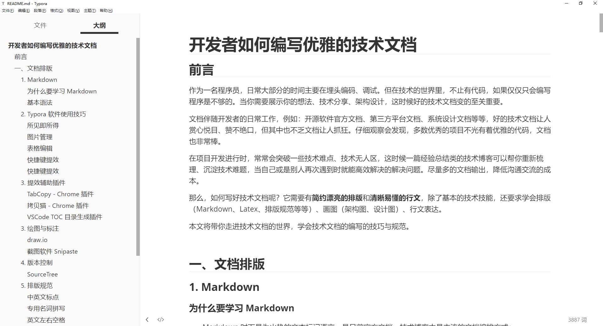

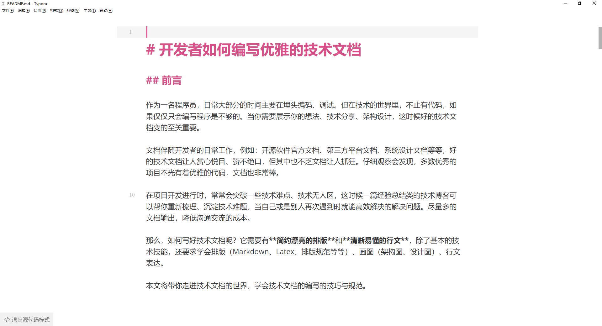


#### 所见即所得

所见即所得，无需 md 基础就可以开始编写。像使用 Word、在线富文本编辑器一样，使用导航栏中的功能即可编辑各种文档格式，编辑完成后自动生成对应的 md 语法。


#### 图片管理

如果使用 md 纯手工的方式添加图片将变的特别麻烦，需要将图片拷贝到对应的文件夹，在文档中使用 `` 标签进行引用。在使用效率上劝退了不少新手。

但是，在 Typora 编辑器中，图片的添加变得特别简单，将截图的图片直接复制即可，或是直接将图片拖动到编辑器中也可以。图片复制效率提升，方便对图片进行统一化管理。

> `文件` - `偏好设置`中请将图片的配置改成如下，`./assets`。配置好后，如果通过截图复制、拖拽图片至 md 文件中，会自动在当前的目录（./assets）下复制进你的图片，可以很轻松的管理你的图片，不必再手写 md 图片标签。


#### 表格编辑

md 源码方式创建表格特别复杂，但是通过 Typora 软件可以极大提升表格编辑效率

* 添加表格，输入行列即可成功添加表格
* 支持表格行、列的删除、移动
* 直接复制 Excel 上的表格到 Typora 自动生成表格


#### 快捷键提效

* **表格快捷键（这个推荐学习）**
  * 表格：<kbd>CTRL</kbd> + <kbd>T</kbd>
  * 移动表格的两行：<kbd>ALT</kbd> + <kbd>上下方向键</kbd>
  * 移动表格的两列：<kbd>ALT</kbd> +  <kbd>左右方向键</kbd>
  * 删除其中一行：<kbd>CTRL</kbd> + <kbd>shift</kbd> + <kbd>delete</kbd>
  * 添加一行：<kbd>CTRL</kbd> + <kbd>enter</kbd>
* 编辑快捷键（直接使用导航栏，逐步学习）
  * 无序列表：输入 - 之后输入空格
  * 有序列表：输入数字 + "." 之后输入空格
  * 标题：<kbd>CTRL</kbd> + <kbd>数字</kbd>
  * 引用：输入 > 之后输入空格
  * 代码块：输入 <kbd>```json</kbd> + <kbd>回车</kbd>
  * 加粗：<kbd>CTRL</kbd> + <kbd>b</kbd>
  * 倾斜：<kbd>CTRL</kbd> + <kbd>i</kbd>
  * 下划线：<kbd>CTRL</kbd> + <kbd>u</kbd>
  * 删除线：<kbd>ALT</kbd> +  <kbd>shift</kbd> + <kbd>5</kbd>
  * 插入图片：直接拖动到指定位置即可
  * 插入链接：<kbd>CTRL</kbd> + <kbd>k</kbd>
* 基础快捷键（直接使用导航栏，逐步学习）
  * 生成目录：输入 `[TOC]` 按回车
  * 选中一整行：<kbd>CTRL</kbd> + <kbd>l</kbd>
  * 选中单词：<kbd>CTRL</kbd> + <kbd>d</kbd>
  * 选中相同格式的文字：<kbd>CTRL</kbd> + <kbd>e</kbd>
  * 跳转到文章开头：<kbd>CTRL</kbd> + <kbd>home</kbd>
  * 跳转到文章结尾：<kbd>CTRL</kbd> + <kbd>end</kbd>
  * 搜索：<kbd>CTRL</kbd> + <kbd>f</kbd>
  * 替换：<kbd>CTRL</kbd> + <kbd>h</kbd>
  * 放大：<kbd>CTRL</kbd> + <kbd>shift</kbd> + <kbd>=</kbd>
  * 缩小：<kbd>CTRL</kbd> + <kbd>shift</kbd> + <kbd>-</kbd>


### 3. 提效辅助插件

#### TabCopy - Chrome 插件

>Quickly copy tabs to the clipboard！

* 插件下载地址：https://chrome.google.com/webstore/detail/tabcopy/micdllihgoppmejpecmkilggmaagfdmb?utm_source=chrome-ntp-icon

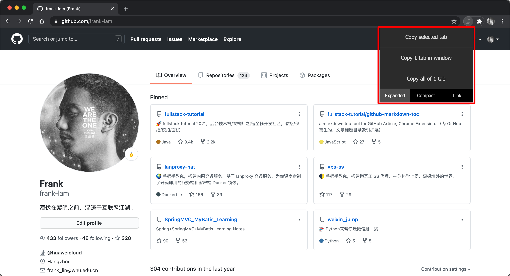

**推荐语**：

你是否还在为 md 中引用添加链接烦恼，使用 TabCopy 即可轻松实现「**文字 + 链接**」的复制。

```markdown
# Expanded
frank-lam/docs-tutorial: 开发者如何编写优雅的技术文档
https://github.com/frank-lam/docs-tutorial

# Compact
frank-lam/docs-tutorial: 开发者如何编写优雅的技术文档: https://github.com/frank-lam/docs-tutorial

# Link
[frank-lam/docs-tutorial: 开发者如何编写优雅的技术文档](https://github.com/frank-lam/docs-tutorial)
```


#### 拷贝猫 - Chrome 插件

该扩展创建了一个右键菜单来提供复制功能，通过在支持的页面内容上单击右键来使用它！

插件下载地址：https://chrome.google.com/webstore/detail/copycat/jdjbiojkklnaeoanimopafmnmhldejbg?hl=zh-CN

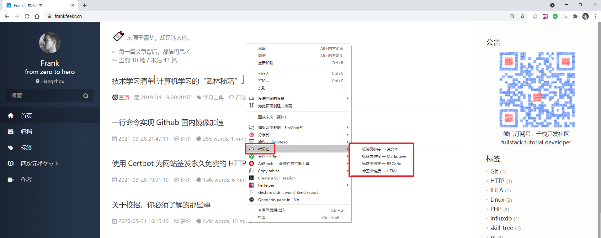


#### VSCode TOC 目录生成插件

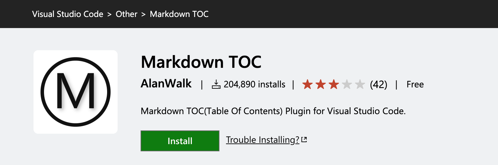

插件地址：https://marketplace.visualstudio.com/items?itemName=AlanWalk.markdown-toc

在你的 md 文档顶部，右键 【Markdown TOC: Insert/Update】即可自动生成文档的目录，效果类似于 `[TOC]`，但是在 Github 中并不支持 `[TOC]` 命令，故可以使用此插件生成目录，在长文阅读的时候提升体验。

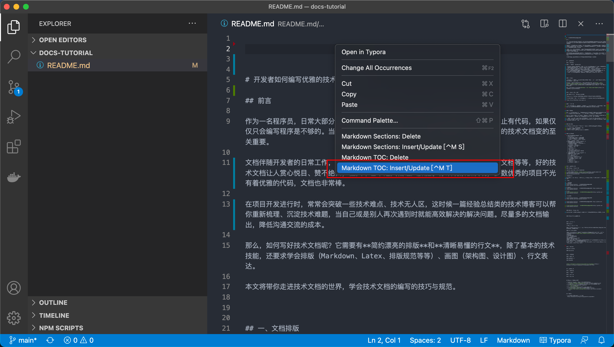

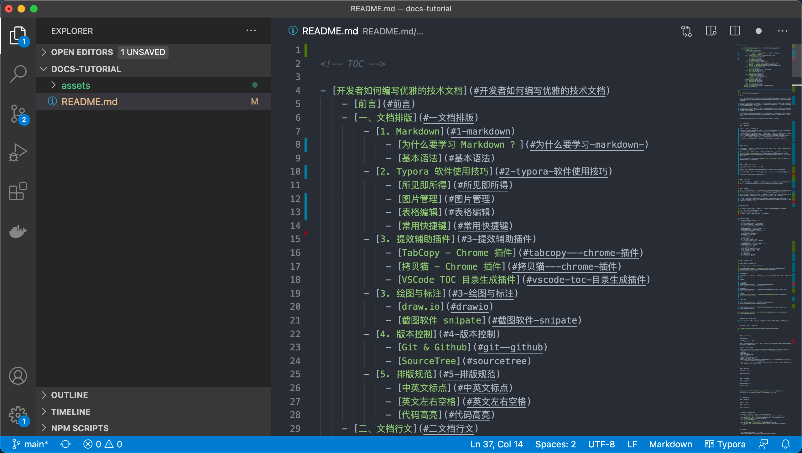


### 3. 绘图与标注

#### draw.io

> draw.io 当前已经改名成 diagrams.net，是一款免费的在线图表编辑工具，可以用来编辑 BPM, org charts, UML, ER图, 网络拓朴图等各种覆盖的图。
>
> 类似于 ProcessOn 的在线画图平台，但是 draw.io 完全免费。支持在线直接画图，chrome 插件客户端，桌面客户端。

- 在线画图：https://app.diagrams.net
- Chrome 插件下载地址：https://chrome.google.com/webstore/detail/diagramsnet-and-drawio-im/cnoplimhpndhhhnmoigbanpjeghjpohi?utm_source=chrome-ntp-icon

* 官网地址：https://www.diagrams.net

推荐使用 **draw.io** 绘图，导出为 svg 图片，效果体验更好，不失真。该软件提供了 chrome 插件，可直接一键快速安装。

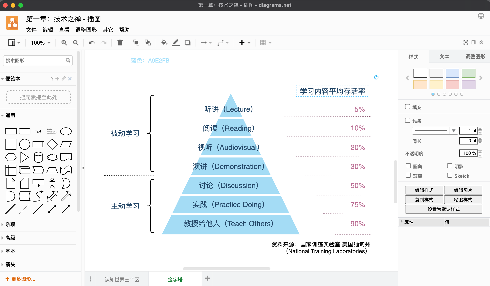


#### 截图软件 Snipaste

> 推荐使用 **Snipaste** 作为你的截图工具。（下载解压无需安装，按下`F1`来开始截图）
>
> 官网：https://zh.snipaste.com

**亮点功能：**

- 自动检测界面元素区域
- 截图清晰不失真
- 支持贴图功能，这个太实用了
- 支持截图的图片回放功能
- 编辑过的截图支持回放再次编辑（在写文档的时候会在截图上有大量的批注工作，这个是非常实用的！目前其他还没有一款截图工具支持这种能力）
- 前端 / 设计 / 原型图设计中，**可作为图片拾色器**（F1 启动截图，确定颜色后按住 C），**参考线**（F1 启动截图，按住 ALT）

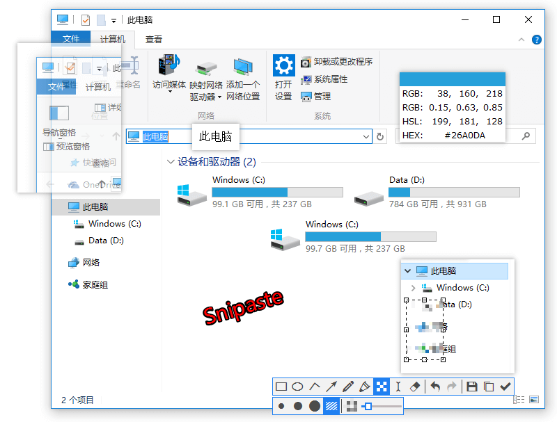


### 4. 版本控制

作为开发者，版本控制肯定会想到 Git，当然你可以使用原生的 Git 命令进行版本控制，但是这里更加推荐可视化工具 SourceTree，让新手无需学习太多命令，轻松上手。特别是在一些图片的版本控制中，方便预览图片。

官网地址：https://www.sourcetreeapp.com

#### SourceTree

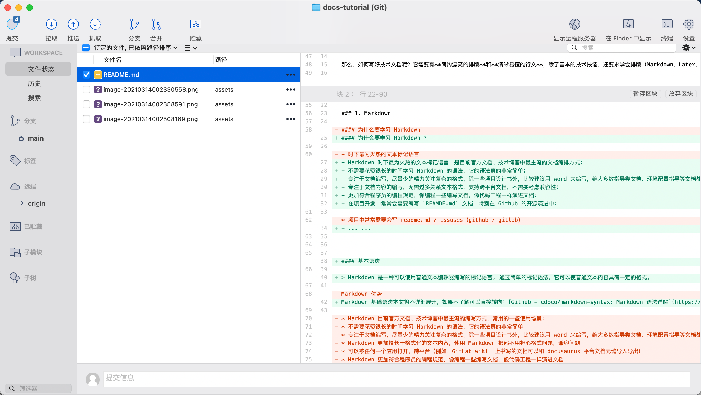

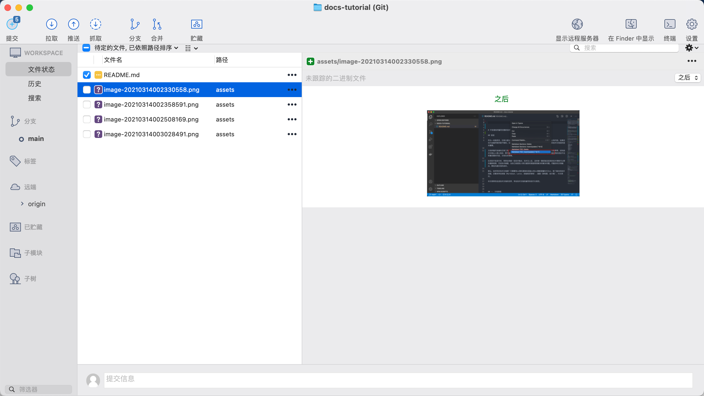


### 5. 排版规范

#### 中英文标点

说明：在文档编写中，必须注意中英文标点符号的使用，在中文的文档中不要出现中英文符号混用的情况。常见符号，如下

| 说明   | 中文 | 英文 |
| ------ | ---- | ---- |
| 逗号   | ，   | ,    |
| 句号   | 。   | .    |
| 分号   | ；   | ;    |
| 问号   | ？   | ?    |
| 感叹号 | ！   | !    |

示例：

```markdown
## 错误写法 ❌
作为一名程序员,日常大部分的时间主要在埋头编码、调试.

## 推荐写法 ✅
作为一名程序员，日常大部分的时间主要在埋头编码、调试。
```


#### 专用名词拼写

示例：

```markdown
## 错误写法 ❌
我热爱 java 编程语言！

## 推荐写法 ✅
我热爱 Java 编程语言！
```


#### 英文左右空格

说明：遇到英文字符或单词，请在左右都加上空格，让文本阅读更加舒适。无论在文档还是平面设计中这也是规范之一，特别是苹果的设计语言中我们都可以看到这一点。

示例：

```markdown
## 错误写法 ❌
窄带LED背光组件使 MacBook Pro支持P3广色域显示，为照片和视频带来绚丽逼真的色彩。

## 推荐写法 ✅
窄带 LED 背光组件使 MacBook Pro 支持 P3 广色域显示，为照片和视频带来绚丽逼真的色彩。
```


#### 使用代码块和代码高亮

 ```markdown
## 代码高亮
先定位到你的目录，然后输入命令 `ls -al` 即可列出该目录下的所有文件。

## 代码块
​```java
public class HelloWorld {
       public static void main(String[] args) {
              System.out.println("我的第一个Java程序：Hello World。");
       }
}
​```
 ```


## 二、文档行文

文档在行文编写部分，个人认为《给程序员的中文写作指北》一文中说明的特别详尽，本节使用原文引用。


### 1. 句子长度

技术文章、博客文章忌用复杂的长句和重句。

主要原因是，当句子一长我们的大脑需要花太多的时间来理解这个句子的字面意义而不能专注于理解这个句子要传达的内容因而这与我们的目的完全南辕北辙。

上面这个句子读起来就非常痛苦了，换位思考一下，如果你的文章这么写读者该多痛苦。我建议，句子的长度应该控制在15个词以内，如果有长句的话，应该用标点切分为较短的句子。同时在重复率不高的情况下，尽量用简单的词汇。上面的句子可以改写为：

主要原因是，当句子一长，我们的大脑需要花太多时间，来理解这个句子的字面意义。而此时我们的大脑无法专注句子本身要传达的内容，这与我们的目的完全相悖。


### 2. 图文并茂

如果有条件，尽量在文章中插入一些与逻辑和表达的内容相关的图片。

图文并茂不光可以让你的读者读起来更轻松，更让你有机会用图表、gif 或其它丰富的媒体形式来表达你的观点，一举几得。同时，如果你的网站需要流量，搜索引擎对相关的图片和视频会增加权重，有利于你的搜索流量增长。


### 3. 起承转合

即使技术文章的主要写作文体更偏向议论文，但在写作时也需要注意起承转合。

如果你需要像本文一样，列出一系列观点，将这些观点以合理的逻辑串起来也是非常重要的。

在文章结构上，我通常会采用总、分、总的结构。

总 - 即文首先告诉读者会读到什么，如果读者不感兴趣的话可以省下来读一篇文章的时间，而如果感兴趣的话正好是个好引子。

分 - 即分散表达需要表达的观点，比如在本文中，即三个部分：关于内容、关于标点和关于行文的三块建议。

总 - 最后总结文章，你要假设读者并没有时间详读全文，但这里的总结可以让读者能在 10 秒内仍然知道你在这篇文章里表达了什么


### 4. 引用链接

把你引用的内容放在合适的位置，不仅是对被引用文章作者的尊重，也方便你的读者继续阅读下去。

千万不要觉得引用文章会让人觉得你只是在观点抄袭，事实上只要你有提出新鲜的观点、论据甚至只是更规范地总结了一篇文章，你的读者也会非常感激你的。

同时引用丰富的链接还可以帮助搜索引擎确定你的权威性——你不光文章写出来了，还指向了靠谱的参考文献，因此搜索引擎也会觉得你这篇文章的靠谱程度很高。


## 附录：主流文档协作平台

* Teambition Thoughts - 面向中小企业的知识管理工具
    * **官网**：https://thoughts.teambition.com
    * **推荐**：特别适合一些产品的对外官方指导或是说明文档
* 石墨文档 - 企业在线协同办公系统平台，支持云端多人在线协作编辑文档和表格
    * **官网**：https://shimo.im
    * **推荐**：将文档的编写真正做到了极致，使用体验和设计风格有点像水墨屏。支持文本、表格、思维导图等等。
* 飞书文档 - 可多人实时编辑的在线文档。
    * **官网**：https://www.feishu.cn
    * **推荐**：飞书系列产品真是把办公体验做到了极致，特别推荐飞书文档中的思维导图，这是我目前用到过的最好用的在线思维导图，好看又好用。
* 语雀 - 专业的云端知识库
    * **官网**：https://www.yuque.com
    * **推荐**：类似于 Thoughts ，团队文档协作


## 参考引用

- 给程序员的中文写作指北 | 卡拉搜索
  https://kalasearch.cn/blog/writing-guide-for-programmers
  
  
  
  <br/>
<div align="center"> </div>
