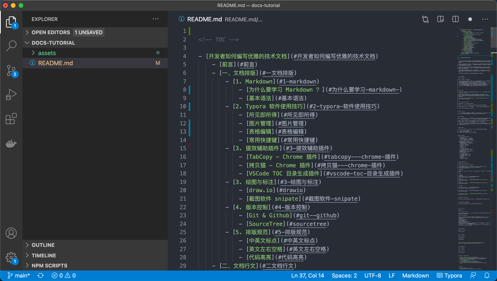

<!-- TOC -->

- [开发者如何编写优雅的技术文档](#开发者如何编写优雅的技术文档)
    - [前言](#前言)
    - [一、文档排版](#一文档排版)
        - [1. Markdown](#1-markdown)
            - [为什么要学习 Markdown ？](#为什么要学习-markdown-)
            - [基本语法](#基本语法)
        - [2. Typora 软件使用技巧](#2-typora-软件使用技巧)
            - [所见即所得](#所见即所得)
            - [图片管理](#图片管理)
            - [表格编辑](#表格编辑)
            - [常用快捷键](#常用快捷键)
        - [3. 提效辅助插件](#3-提效辅助插件)
            - [TabCopy - Chrome 插件](#tabcopy---chrome-插件)
            - [拷贝猫 - Chrome 插件](#拷贝猫---chrome-插件)
            - [VSCode TOC 目录生成插件](#vscode-toc-目录生成插件)
        - [3. 绘图与标注](#3-绘图与标注)
            - [draw.io](#drawio)
            - [截图软件 snipate](#截图软件-snipate)
        - [4. 版本控制](#4-版本控制)
            - [SourceTree](#sourcetree)
        - [5. 排版规范](#5-排版规范)
            - [中英文标点](#中英文标点)
            - [专用名词拼写](#专用名词拼写)
            - [英文左右空格](#英文左右空格)
            - [使用代码块和代码高亮](#使用代码块和代码高亮)
    - [二、文档行文](#二文档行文)
        - [1. 句子长度](#1-句子长度)
        - [2. 图文并茂](#2-图文并茂)
        - [3. 起承转合](#3-起承转合)
        - [4. 引用链接](#4-引用链接)
    - [附录：主流文档协作平台](#附录主流文档协作平台)
    - [参考引用](#参考引用)

<!-- /TOC -->


# 开发者如何编写优雅的技术文档

## 前言

作为一名程序员，日常大部分的时间主要在埋头编码、调试。但在技术的世界里，不止有代码，如果仅仅只会编写程序是不够的。当你需要展示你的想法、技术分享、架构设计，这时候好的技术文档变的至关重要。

文档伴随开发者的日常工作，例如：开源软件官方文档、第三方平台文档、系统设计文档等等，好的技术文档让人赏心悦目、赞不绝口，但其中也不乏文档让人抓狂。仔细观察会发现，多数优秀的项目不光有着优雅的代码，文档也非常棒。

在项目开发进行时，常常会突破一些技术难点、技术无人区，这时候一篇经验总结类的技术博客可以帮你重新梳理、沉淀技术难题，当自己或是别人再次遇到时就能高效解决的解决问题。尽量多的文档输出，降低沟通交流的成本。

那么，如何写好技术文档呢？它需要有**简约漂亮的排版**和**清晰易懂的行文**，除了基本的技术技能，还要求学会排版（Markdown、Latex、排版规范等等）、画图（架构图、设计图）、行文表达。

本文将带你走进技术文档的世界，学会技术文档的编写的技巧与规范。


## 一、文档排版

### 1. Markdown

#### 为什么要学习 Markdown ？

- Markdown 时下最为火热的文本标记语言，是目前官方文档、技术博客中最主流的文档编排方式；
- 不需要花费很长的时间学习 Markdown 的语法，它的语法真的非常简单；
- 专注于文档编写，尽量少的精力关注复杂的格式。除一些项目设计书外，比较建议用 word 来编写，绝大多数指导类文档、环境配置指导等文档都推荐使用 markdown 来书写；
- 专注于文档内容的编写，无需过多关系文本格式，支持跨平台文档，不需要考虑兼容性；
- 更加符合程序员的编程规范，像编程一些编写文档，像代码工程一样演进文档；
- 在项目开发中常常会需要编写 `REAMDE.md` 文档，特别在 Github 的开源演进中；

- ... ...


#### 基本语法

> Markdown 是一种可以使用普通文本编辑器编写的标记语言, 通过简单的标记语法，它可以使普通文本内容具有一定的格式。

Markdown 基础语法本文将不详细展开，如果不了解可以直接转向：[Github - cdoco/markdown-syntax: Markdown 语法详解](https://github.com/cdoco/markdown-syntax)。对于基础语法，笔者认为略有了解即可，在下面将会隆重 Typora 编辑器，所见即所得，让你爱上 Markdown。

如果感兴趣，可以看看发展历史：[Markdown - 维基百科，自由的百科全书](https://zh.wikipedia.org/wiki/Markdown)


### 2. Typora 软件使用技巧

>你是否还在苦恼学习 Markdown 语法呢？
>
>Typora 目前是 Markdown 文档编写最好的编辑器，有了它会让你爱上文档编写！
>
>像富文本编辑器一样，所见即所得，无需关注过多 markdown 语法，方便新手快速上手！
>
>话不多说，上链接：https://www.typora.io


#### 所见即所得

所见即所得，无需 md 基础就可以开始编写。像使用 word 编辑器、在线富文本编辑器一样，使用编辑器导航中的选项即可编辑文档，编辑完成自动生成对应的 Markdown 语法。


#### 图片管理

如果使用 md 纯手工的方式添加图片将变的特别麻烦，需要将图片拷贝到对应的文件夹，在文档中使用 `` 标签进行引用。在使用效率上劝退了不少新手。

但是，在 Typora 编辑器中，图片的添加变得特别简单，将截图的图片直接复制即可，或是直接将图片拖动到编辑器中也可以。图片复制效率提升，方便对图片进行统一化管理。

> `文件`-`偏好设置`中请将图片的配置改成如下，`./assets`。配置好后，如果通过截图复制、拖拽图片至 md 文件中，会自动在当前的目录（./assets）下复制进你的图片，可以很轻松的管理你的图片，不必再手写 md 标签。


#### 表格编辑

md 源码方式创建表格特别复杂，但是通过 Typora 软件可以极大提升表格编辑效率

* 添加表格，输入行列即可成功添加表格
* 支持表格行、列的删除、移动
* 直接复制 Excel 上的表格到 Typora 自动生成表格


#### 常用快捷键

* **表格快捷键（这个推荐学习）**
  * 表格：ctrl + t
  * 移动表格的两行：alt + 上下方向键
  * 移动表格的两列：alt + 左右方向键
  * 删除其中一行：ctrl + shift + delete
  * 添加一行：ctrl + enter
* 编辑快捷键（直接使用导航栏，逐步学习）
  * 无序列表：输入 - 之后输入空格
  * 有序列表：输入数字 +“.”之后输入空格
  * 标题：ctrl + 数字
  * 引用：输入 > 之后输入空格
  * 代码块：```json 回车
  * 加粗：ctrl + b
  * 倾斜：ctrl + i
  * 下划线：ctrl + u
  * 删除线：alt + shift + 5
  * 插入图片：直接拖动到指定位置即可
  * 插入链接：ctrl + k
* 基础快捷键（直接使用导航栏，逐步学习）
  * 生成目录：`[TOC]`按回车
  * 选中一整行：ctrl + l
  * 选中单词：ctrl + d
  * 选中相同格式的文字：ctrl + e
  * 跳转到文章开头：ctrl + home
  * 跳转到文章结尾：ctrl + end
  * 搜索：ctrl + f
  * 替换：ctrl + h
  * 放大：ctrl + shift + =
  * 缩小：ctrl + shift + -


### 3. 提效辅助插件

#### TabCopy - Chrome 插件

>Quickly copy tabs to the clipboard！

* 插件下载地址：[TabCopy - Chrome 网上应用店](https://chrome.google.com/webstore/detail/tabcopy/micdllihgoppmejpecmkilggmaagfdmb?utm_source=chrome-ntp-icon)

**推荐语**：

你是否还在为 md 中引用添加链接烦恼，使用 TabCopy 即可轻松实现「**文字 + 链接**」的复制。

- 源码

```markdown
# Expanded
frank-lam/docs-tutorial: 开发者如何编写优雅的技术文档
https://github.com/frank-lam/docs-tutorial

# Compact
frank-lam/docs-tutorial: 开发者如何编写优雅的技术文档: https://github.com/frank-lam/docs-tutorial

# Link
[frank-lam/docs-tutorial: 开发者如何编写优雅的技术文档](https://github.com/frank-lam/docs-tutorial)
```

- 效果如下

frank-lam/docs-tutorial: 开发者如何编写优雅的技术文档
https://github.com/frank-lam/docs-tutorial


frank-lam/docs-tutorial: 开发者如何编写优雅的技术文档: https://github.com/frank-lam/docs-tutorial


[frank-lam/docs-tutorial: 开发者如何编写优雅的技术文档](https://github.com/frank-lam/docs-tutorial)


#### 拷贝猫 - Chrome 插件

该扩展创建了一个右键菜单来提供复制功能，通过在支持的页面内容上单击右键来使用它！


#### VSCode TOC 目录生成插件


插件地址：https://marketplace.visualstudio.com/items?itemName=AlanWalk.markdown-toc

在你的 md 文档顶部，右键 【Markdown TOC: Insert/Update】即可自动生成文档的目录，效果类似于 `[TOC]`，但是在 Github 中并不支持 `[TOC]` 命令，故可以使用此插件生成目录，在长文阅读的时候提升体验。





### 3. 绘图与标注

#### draw.io

* 学会使用 svg 作为图片

推荐使用 **draw.io** 绘图，导出为 svg 图片，效果体验更好，不失真。该软件提供了 chrome 插件，可直接一键快速安装。


#### 截图软件 snipate

> 推荐使用**snipate**作为你的截图工具。（下载解压无需安装，按下`F1`来开始截图）
> 官方文档：Snipaste:[https://docs.snipaste.com/zh-cn](https://docs.snipaste.com/zh-cn)

**亮点功能：**

- 自动检测界面元素区域
- 截图清晰不失真
- 支持贴图功能，这个太实用了
- 支持截图的图片回放功能
- 编辑过的截图支持回放再次编辑（在写文档的时候会在截图上有大量的批注工作，这个是非常实用的！目前其他还没有一款截图工具支持这种能力）
- 前端 / 设计 / 原型图设计中，**可作为图片拾色器**（F1 启动截图，确定颜色后按住 C），**参考线**（F1 启动截图，按住 ALT）


### 4. 版本控制

作为开发者，版本控制肯定会想到 Git，当然你可以使用原生的 Git 命令进行版本控制，但是这里更加推荐可视化工具 SourceTree，让新手无需学习太多命令，轻松上手。特别是在一些图片的版本控制中，方便预览图片。

#### SourceTree


### 5. 排版规范

#### 中英文标点

说明：在文档编写中，必须注意中英文标点符号的使用，在中文的文档中不要出现中英文符号混用的情况。常见符号，如下

| 说明   | 中文 | 英文 |
| ------ | ---- | ---- |
| 逗号   | ，   | ,    |
| 句号   | 。   | .    |
| 分号   | ；   | ;    |
| 问号   | ？   | ?    |
| 感叹号 | ！   | !    |

示例：

```markdown
## 错误写法 ❌
作为一名程序员,日常大部分的时间主要在埋头编码、调试.

## 正确写法 ✅
作为一名程序员，日常大部分的时间主要在埋头编码、调试。
```


#### 专用名词拼写

示例：

```markdown
## 错误写法 ❌
我热爱 java 编程语言！

## 正确写法 ✅
我热爱 Java 编程语言！
```


#### 英文左右空格

说明：遇到英文字符或单词，请在左右都加上空格，让文本阅读更加舒适。无论在文档还是平面设计中这也是规范之一，特别是苹果的设计语言中我们都可以看到这一点。

示例：

```markdown
## 错误写法 ❌
窄带LED背光组件使 MacBook Pro支持P3广色域显示，为照片和视频带来绚丽逼真的色彩。

## 正确写法 ✅
窄带 LED 背光组件使 MacBook Pro 支持 P3 广色域显示，为照片和视频带来绚丽逼真的色彩。
```


#### 使用代码块和代码高亮

代码高亮

```markdown
先定位到你的目录，然后输入命令 `ls -al` 即可列出该目录下的所有文件。
```


代码块

 ```java
​```java
public class HelloWorld {
       public static void main(String[] args) {
              System.out.println("我的第一个Java程序：Hello World。");
       }
}
​```
 ```


## 二、文档行文

### 1. 句子长度

### 2. 图文并茂

### 3. 起承转合

### 4. 引用链接


## 附录：主流文档协作平台

* Teambition Thoughts | 面向中小企业的知识管理工具
    * [https://thoughts.teambition.com](https://thoughts.teambition.com)
* 石墨文档-企业在线协同办公系统平台,支持云端多人在线协作编辑文档和表格
    * [https://shimo.im](https://shimo.im)
* 语雀 - 专业的云端知识库
    * [https://www.yuque.com](https://www.yuque.com)
* 可多人实时编辑的在线文档软件-在线文档（云文档）-飞书官网
    * [https://www.feishu.cn/product/docs](https://www.feishu.cn/product/docs)


## 参考引用

- 给程序员的中文写作指北 | 卡拉搜索
  https://kalasearch.cn/blog/writing-guide-for-programmers